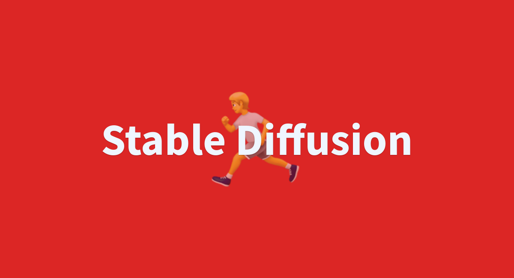

# Stable Diffusion 咒语书 - 法师版

年轻的法师们,欢迎来到Stable Diffusion的魔法咒语宝库!这里收录了各种强大的咒语,可以召唤Stable Diffusion的魔力,创造出奇妙的图像。

这些咒语就像魔杖一样,可以控制Stable Diffusion照你的意愿创作艺术品。正确念出咒语的法术结合体现了魔法师的意志,你也可以成为控制图像魔法的大师!

## 你会在这里找到什么？
🎯 最佳实践：Stable Diffusion提示词的创建和使用方法。
🎲 示例和模板：帮助你理解和启发你的实战应用。
🛠️ 工具和资源：帮助你更好地生成和优化你的提示。

## 咒语
### 咒语的结构
主体+场景+质量风格+照明+色彩+情绪+构图
主体：图像的主要对象，人或者物。
场景：背景或环境。
风格：风格。
照明：图像的照明条件。
色彩：主要颜色。
情绪：情绪或氛围。
构图：构图或布局。

### 人物或者主体特征
服饰穿搭 white dress
发型发色 blonde hair，long hair
五官特征 small eye，big mouth
面部表情 smiling
肢体动作 stretching arms
beautiful detailed eyes 美丽细致的眼睛
highly detailed skin 高度细致的皮肤
extremely delicate and beautiful girls 非常精致和美丽的女孩

### 场景特征
室内/室外 indoor/outdoor
大场景 forest，city，street
小细节 tree，bush，white flower

### 环境光照
白天/黑夜 day/night
特定时段 morning/sunset
光环境 sunlight，bright，dark
天空 blue sky，starry sky
cinematic lighting(电影光)
dynamic lighting(动感光)

### 视线
looking at viewer 看着观众
looking at another 看另一个
looking away 斜视
looking back 回头看
looking up 仰望、仰视、抬头

### 画幅视角
距离 close-up，distant
人物比例 full body，upper body
观察视角 from above，view of back
镜头类型 wide angle，Sony A7 III
dynamic angle 动态角度
from above 从上方
from below 从下面
wide shot 广角镜头
Aerial View 空中摄影照片、航摄照片、鸟（俯）瞰图

### 构图
dynamic angle
from above
from below
wide shot
Aerial View
full body shot(全身)
cowboy shot ( 半身)
close-up shot (接近)
looking at viewer
looking at another
looking away
looking back
looking up

### 人物表情
blush 脸红
wet sweat 大汗
flying sweatdrops 飞汗

### 衣服指定
china dress 旗袍
sailor dress 水手服
school uniform 校服
sailor senshi uniform 水手服战士

### 姿势指定
hands on 手上的 例hands on own face, hands on feet, hands on breast
kneeling 跪着的
hand between legs 手放在两腿之间
hair flip 头发翻转
skirt flip 裙摆翻转

### 画风提示词
插画风 illustration,paining,painthbrush
二次元 anime,comic,game CG
写实系 photorealistic,realistic,photograph
手绘风 sketch, one-hour drawing challenge

### 标准化提示词
特定高分辨率类型
extremely detailed CG unity 8K wallpaper 超精细的8K Unity游戏CG
unreal engine rendered 虚拟引擎渲染
起手式输入下述提示词，生成图片质量就会提高
best quality, ultra-detailed, masterpiece, finely detail, highres, 8k wallpaper

画人时添加下列提示词，可大幅提升人物细节精细度。
beautiful detailed eyes

highly detailed skin
extremely delicate and beautiful girls
1 girl,（1个女孩）
detailed beautiful skin,（细致美丽的肌肤）
kind smile,（亲切的微笑）
absurdres,（夸张）
detailed-beautiful-face,（精致美丽的容颜）
petite figure,（身材娇小）
detailed skin texture,（细致的皮肤纹理）
pale skin,（白皙肌肤）
detailed hair,（细致的头发）
random hair style,（随意发型，）
detailed eyes,（细致的眼睛）
glistening skin,（晶莹剔透肌肤）
clean face,pretty face,sexy, cool, naughty face,((twintails))

## 如何贡献？
我们欢迎所有人的贡献！无论你是AI大师，还是画师，只要你有好的想法或经验，我们都欢迎你分享。

## 开源协议
这个项目遵循Apache 2.0开源协议。这意味着你可以自由使用、修改和分发这个项目，但你需要保留原始的版权声明。完整的协议内容，请查看LICENSE文件。🚀